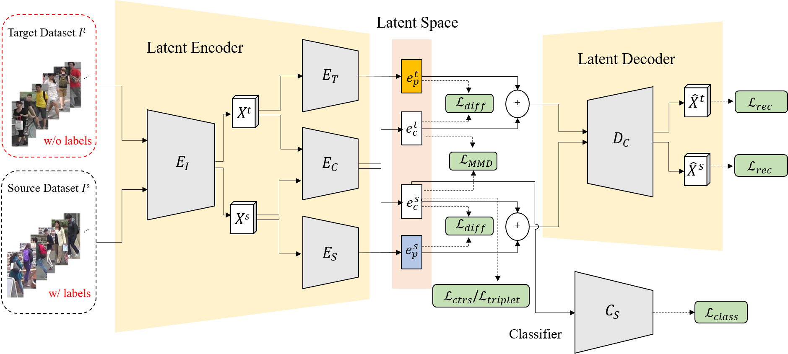

# Adaptation and Re-Identification Network: An Unsupervised Deep Transfer Learning Approach to Person Re-Identification

<p align="center"></p>

[[Paper]](http://openaccess.thecvf.com/content_cvpr_2018_workshops/papers/w6/Li_Adaptation_and_Re-Identification_CVPR_2018_paper.pdf)


Pytorch implementation for our CVPR 2018 Workshop paper. This version of code is the draft. We note that the original workshop paper (short paper) has some unclear parts and we will address this by submitting the entire version in the future.

## Prerequisites
- Python 3
- [Pytorch](https://pytorch.org/)

## Getting Started

### Datasets
We conduct experiments on [Market1501](http://www.liangzheng.org/Project/project_reid.html), [DukeMTMC-reID](https://github.com/layumi/DukeMTMC-reID_evaluation)
- Create directories for datasets:
```
mkdir datasets
cd datasets/
``` 

### Training
We use a train our model based on `ResNet-50`. Example for excuting the program:
```
python3 reid_main.py\
    --use_gpu $GPU\
    --source_dataset Duke \
    --target_dataset Market\
    --rank 1\
    --learning_rate 1e-3\
    --dist_metric L1\
    --model_dir $MODEL_DIR\
    --model_name $MODEL_NAME\
    --w_loss_rec 0.1\
    --w_loss_dif 0.1\
    --w_loss_mmd 0.1\
    --w_loss_ctr 0.1\
    --batch_size 16\
    --pretrain_model_name MODEL_DIR/$MODEL_NAME\
```
###  Download the trained model
The pretraied model will be provided later
- DukeMTMC --> Market1501 model: [[Google Drive]]()
- Market1501 --> DukeMTMC model: [[Google Drive]]()


## Citation
Please cite our paper if you find the code useful for your research.
```
@InProceedings{Li_2018_CVPR_Workshops,
author = {Li, Yu-Jhe and Yang, Fu-En and Liu, Yen-Cheng and Yeh, Yu-Ying and Du, Xiaofei and Frank Wang, Yu-Chiang},
title = {Adaptation and Re-Identification Network: An Unsupervised Deep Transfer Learning Approach to Person Re-Identification},
booktitle = {The IEEE Conference on Computer Vision and Pattern Recognition (CVPR) Workshops},
month = {June},
year = {2018}
}
```
